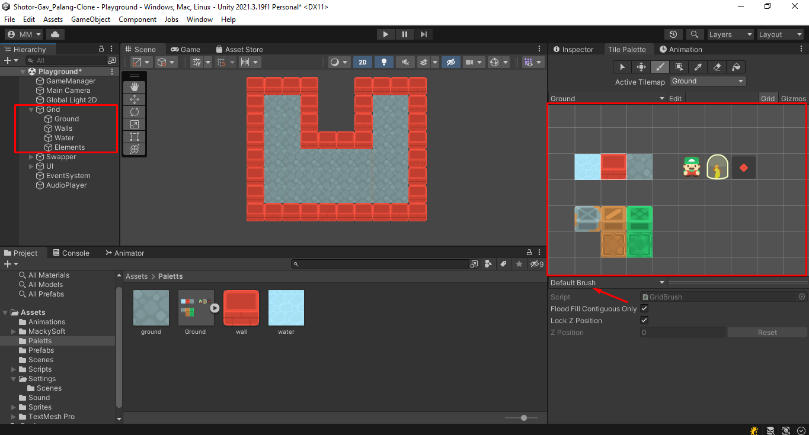
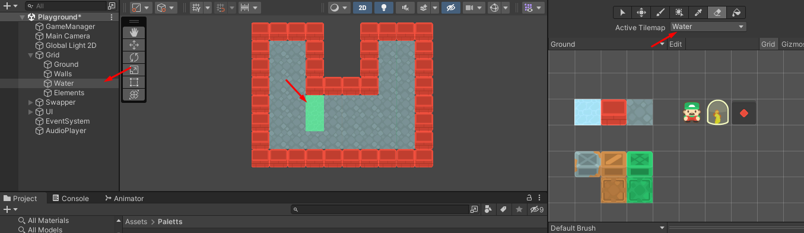
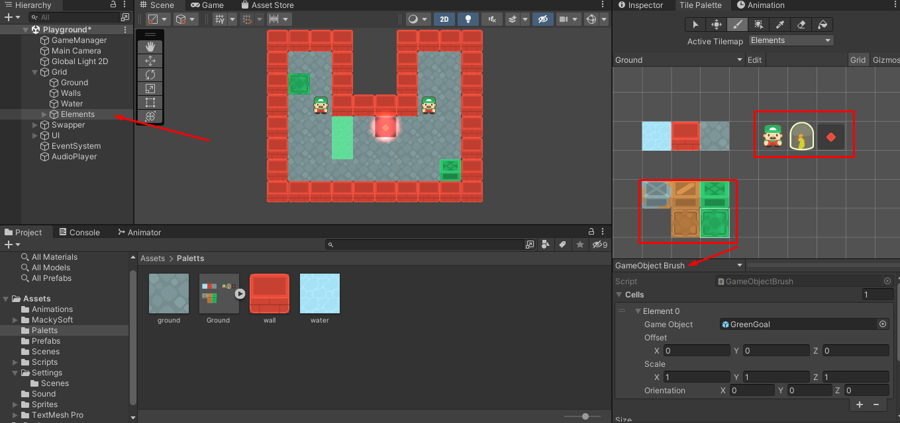
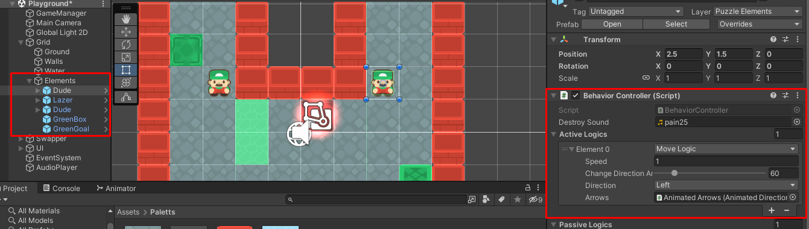
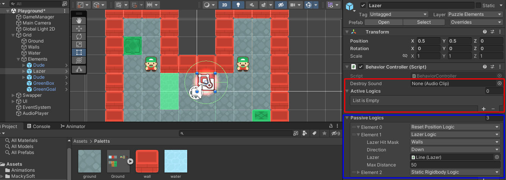
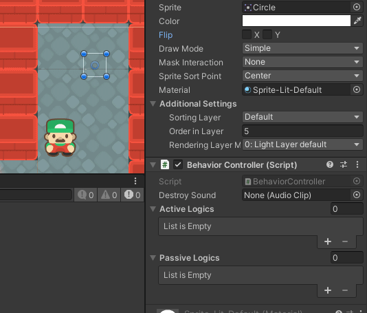

# How To Design Levels
Game is based on tilemaps so you can create maps and place puzzle elements with ease   

Lets look at this playground scene for example
## 1. Maps

 - There are 3 tilemaps stacked on top of each other, each with its own properties, collidable, triggerable, etc  
 - You can use the `Defualt brush` to draw in each of the **Ground, Wall, Water** tilemaps

- Make sure to select the map first before using the brush

## 2.Puzzle Elements

- Adding Puzzle elements is also the same
- However, make sure to use the `GameObject Brush` for adding puzzle elements
- Choose the **Elements** map for gameobjects, since it comes with an animation
#### There are only two goal boxes with their coresponding platforms, but you can add as many as you want, just make sure to change their ID and maybe their sprites to have more variations if you wish

- You can find properties of each element in their `BehaviorController`, including moving direction, speed, animations, sounds, etc.

- each element has two sets of logics or actions of you will.
- Active logics occur every fixed update
- Passive logics happen once every swap or when game restarts  
- Some logics are stackable, meaning you can have more than one of it on the same object.
- Some actions are not stackable and if you try to add them to the same object it will explode in your face with a fat juicy red error, example: Move logic is not stackable because in this game you can move in one direction only (let me know if that changes though)  
  
## Making New Elements
  
- Here you can see it in action.
- I reccomend try adding some boxes **without** the `StaticLogic`. its fun to play with. This was a bug in the MoveLogic at first but I decided instead of changing that having the ability to push boxes is fun.  
### Disclaimer
I really dont recommend mixing  too many logics, since this feature is not fully fleshed out, and the part that I have tested has some known issues, like, adding a lazer to a moving object does work but not as you would hope so. its a work in progress.