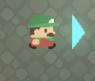
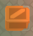
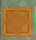
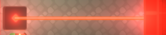
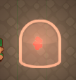
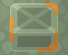
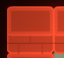
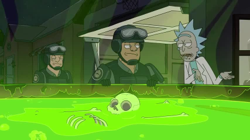
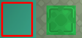

# Game Mechanics
## 1. Freeze the game
- using right mouse button game freezes
- moving objects show the direction they will be moving
  + 
- you can still switch roles during frozen game

## 2. Swap Behavior    
Player can select <mark>two objects</mark> and swap their behavior  
Change is not instant and takes a short animation to run before actually affecting the game

## 3. Interact in Lit Area
in a dark room player can interact with lit objects only  
if an object is selected however, in case it moves towards a dark area it remains being selected

## Puzzle Elements
### Green Box
   
The target box to be moved towards the end platform  
  
this brown box is the same as the main box but has its own end platform
the level is considered done, only when all of these boxes are in the right spot, respectively  
### End Platform
   
This is the platform that detects the [green target box](#green-box)   
  
Same, but this only reacts to the brown box  

### Dude
  

This guy moves either horizontally or vertically, upon hitting something it goes backwards

### Lazer

shoots a lazer line in a determined direction until hitting a wall  
**emits light**  
destroys everything in its path

### Light Source
  
Emits light in a circle

### Prop Box
  
Just a normal box with no special behavior

## Environment & Tiles
Game has a grid based level with different tiles,each having its own logic, with or without collider, etc.

### wall

- [x] collider
- [ ] trigger

### Ground

- [ ] collider
- [ ] trigger

### Just "Water"
  
  
- [x] collider
- [x] trigger  
Kills everything that touches it

## Ideas about Implementation
- Use tile maps and a grid system for the level
- Use prefab brushes for puzzle elements
- For each new logic create a normal c# class instead of mono behavior for testability and performance
  - not adding and removing components is a good idea (performance wise), so try to avoid it
